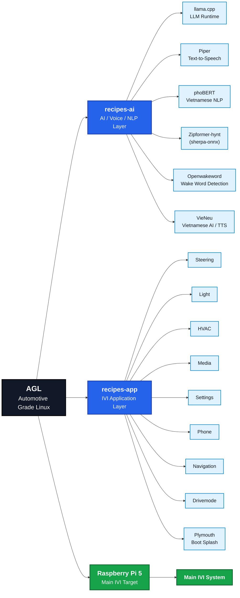

# Automotive Grade Linux OS (create IVI)

**AGL repo source code**
```

$ mkdir AGL_Demo
$ cd AGL_Demo
$ repo init -u https://github.com/automotive-grade-linux/AGL-repo.git -b trout -m trout_20.0.0.xml
$ repo sync -j$(nproc)

```

**Build for Raspberrypi5**

```
$ source meta-agl/scripts/aglsetup.sh -f -m raspberrypi5 agl-demo agl-devel
$ cd conf
$ nano local.conf
```
After opening the local.conf file, insert the following content into the file. Then run the bitbake command to build the image
```
$ MACHINE="raspberrypi5"
$ bitbake agl-ivi-demo-qt
```

Check whether the file "agl-ivi-demo-qt-raspberrypi5.rootfs.wic.xz" has been successfully generated. Then you can use "balenaEtcher" on Windows or the "bmap tool" to write the image to an SD card or SSD
If using the bmap tool, execute the following command. (X) is the flash device name obtained using the lsblk command
```
$ sudo apt update
$ sudo apt install bmap-tools
$ lsblk
$ sudo umount /dev/sdX*
$ sudo bmaptool copy agl-ivi-demo-qt-raspberrypi5.rootfs.wic.xz /dev/sdX
```

